# YVtils Collection

This repository combines all the yvtils minecraft plugins in one place, for easier access and management.

## For contributors

- Creating a new feature module? See
  [docs/adding-a-new-module.md](./docs/adding-a-new-module.md).
- Migrating an existing module or core to the new dynamic module system? See
  [docs/migrating-to-dynamic-modules.md](./docs/migrating-to-dynamic-modules.md).

## Plugins included in this collection

- YVtils-SMP **(IN MIGRATION PROCESS)**
- YVtils-Discord ([Modrinth](https://modrinth.com/plugin/yvtils_dc))
    - [Core](https://github.com/YVtils/yvtils_collection/tree/main/discord-core)
    - [Logic](https://github.com/YVtils/yvtils_collection/tree/main/discord)
- YVtils-MultiMine ([Modrinth](https://modrinth.com/plugin/yvtils_mm))
    - [Core](https://github.com/YVtils/yvtils_collection/tree/main/multiMine-core)
    - [Logic](https://github.com/YVtils/yvtils_collection/tree/main/multiMine)
- YVtils-Regions ([Modrinth](https://modrinth.com/plugin/yvtils_rg)) **(IN RECODE PROCESS)**
    - [Core](https://github.com/YVtils/yvtils_collection/tree/main/regions-core)
    - [Logic](https://github.com/YVtils/yvtils_collection/tree/main/regions)
- YVtils-YV_SMP **(IN MIGRATION PROCESS)**

---

## Modules in this Collection

### Remade Ender Dragon

Player-scaled dragon encounters with configurable attacks, team support, and
admin previews. See [the module guide](docs/remade-ender-dragon.md).

### common

### config

### core

### discord

Modal-based SMP registration, linked-account commands and InvUI management:
[setup, migration, permissions and verification](docs/discord-registration.md).

### discord-core

### essentials

### fusion

### gui

### message

### migration

### moderation

### multiMine

### multiMine-core

### regions

### regions-core

### server

### sit

### stats

### status

### test-core

### vanish

### waypoint

### yv_smp-core

---

- Translations: [Crowdin](https://crowdin.com/project/yvtils-collection)

- Trailer: [Chapter Two Trailer](https://youtu.be/gQi54Pd_SWE)

# Modules

## Discord Module

- Tutorial: [Discord Module Setup Guide](https://youtu.be/YQiYSjEcdMk)

- Chat Sync

  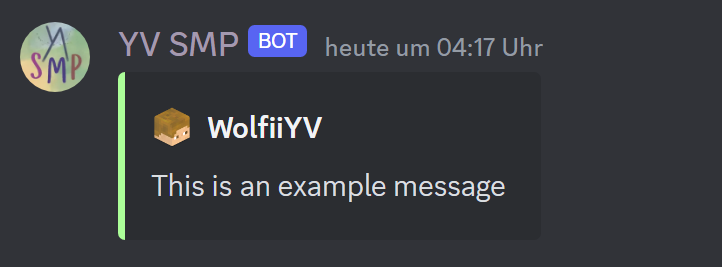
- Minecraft Server Stats

  
  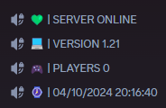
- Console Sync

  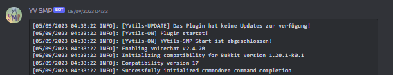
- Whitelist with Discord

## Status Module

`/status set <status>`
`/status default <status>`
`/status clear [player]`

Let players set a status before their name.

## Sit Module

`/sit`

Let players sit down everywhere.

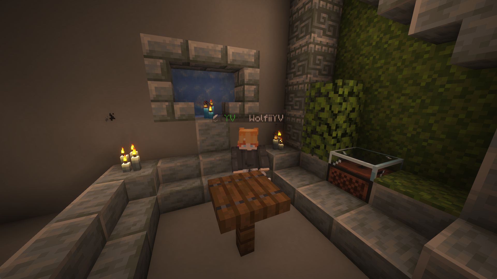

## Extended Vanish Module

`/v [quick]`

- Silent Container Interaction
- No Mob Targeting
- Ignore dropped items
- Layer System
    - Higher Layer Players can see Lower Layer Players, but not vice versa.

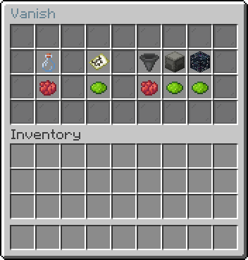

## Moderation Module

- Ban Command `/ban <player> [reason]`
- Tempban Command `/tempban <player> <time> <unit> [reason]`
- Kick Command `/kick <player> [reason]`
- Mute Command `/mute <player> [reason]`
- Tempmute Command `/tempmute <player> <time> <unit> [reason]`
- Unban Command `/unban <player>`
- Unmute Command `/unmute <player>`

## Fusion Module / Custom Crafting

`/fusion [manage]`

- Let players craft custom items
    - Invisible Item Frames

      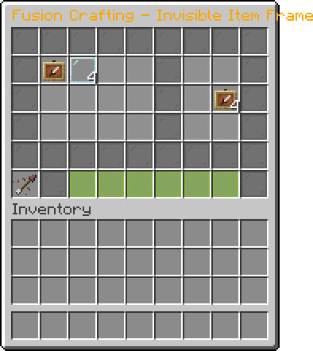

    - Light Blocks

      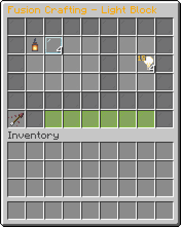

    - Custom Player Heads

      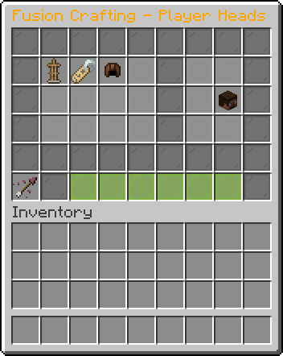

- Manage existing or create new fusions

  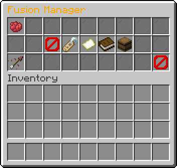

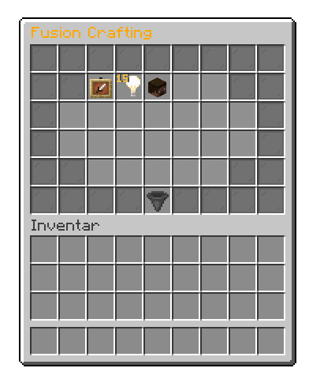

## MultiMine Module (VeinMiner & Timber)

`/mm add [block]`
`/mm addMultiple`
`/mm remove [block]`
`/mm removeMultiple`

- MultiMine Blocks
- Add/Remove multiple blocks at once with a container in your hand

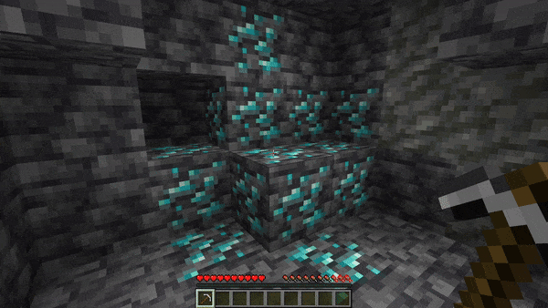
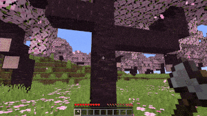

## Server Module

- Maintenance Mode
- Custom MOTD

  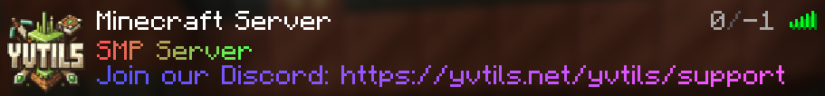
- Fake Max Player Count
- Customizable Player Info Text

  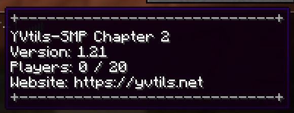

## Waypoints Module

`/waypoint <naviagte/create/delete> <name> [visibility]`

- Create waypoints with visibilities
    - Public - Everyone can see it
    - Private - Only you can see it
    - Unlisted - Only you can see it, but others can navigate to it
- Navigate to waypoints

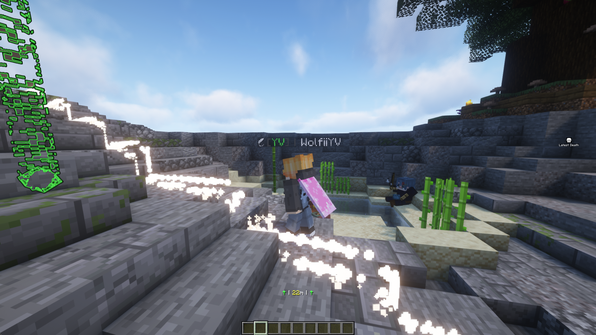

## Other Features

- Anti Too Expensive
    - Bypasses the "Too Expensive" Enchantment Limit

  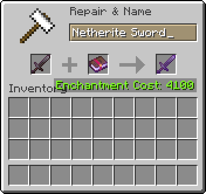

- MSG System
    - `/msg <player> <message>`
    - `/r <message>`

  

- Spawn Elytra
    - Optional `essentials` feature: double-jump near spawn to glide without an Elytra;
      use the swap-offhand key for one boost per flight.
    - Enable with `spawnElytra.enabled: true` in `plugins/yvtils/essentials/config.yml`.
      Configure `worlds` (default `[world]`), `radius` (default `100.0`, 3D distance),
      and `boostStrength` (default `2.0`) under `spawnElytra`, then restart.
    - Survival only; protects against fall/wall damage during the flight and respects `/fly`.

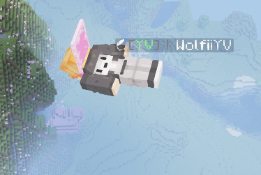

# Commands

- Fly Command `/fly [player]`
- Heal Command `/heal [player]`
- Speed Command `/speed <speed> [player]`
- God Command `/god [player]`
- GlobalMute Command `/gmute [state]`
- Gamemode Command `/gm <gamemode> [player]`
- Seed Command `/seed show`

# Other

## Smart Language System

[Discord](https://discord.gg/qHpMsduU7p)
